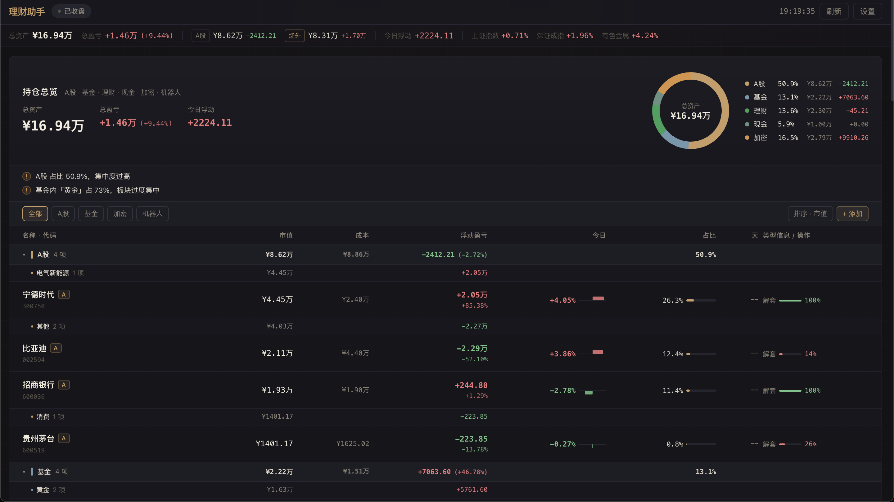
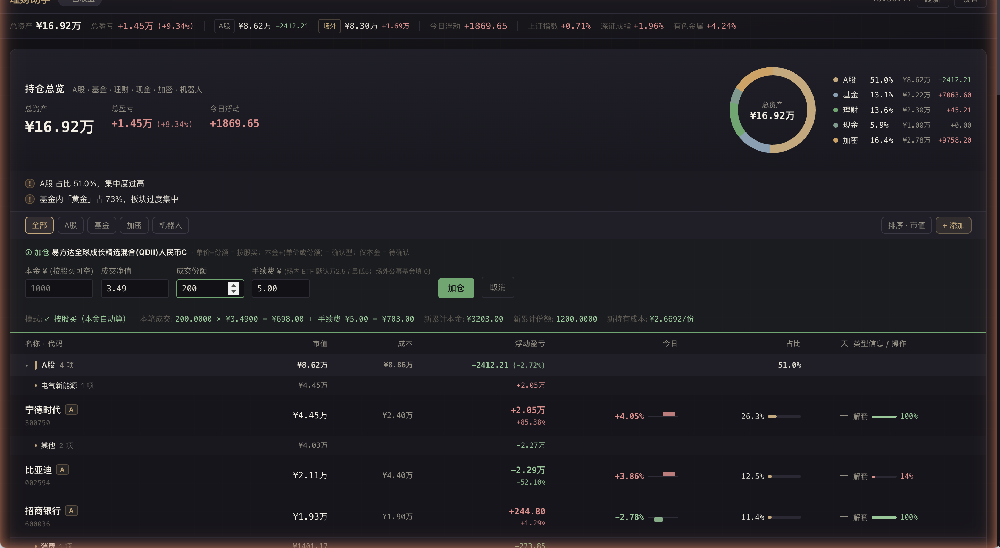
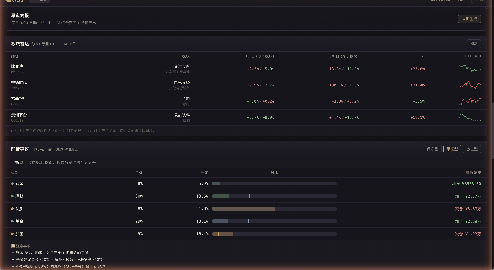
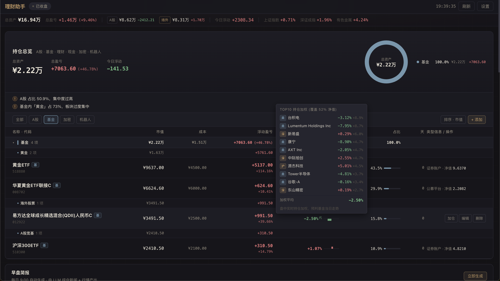
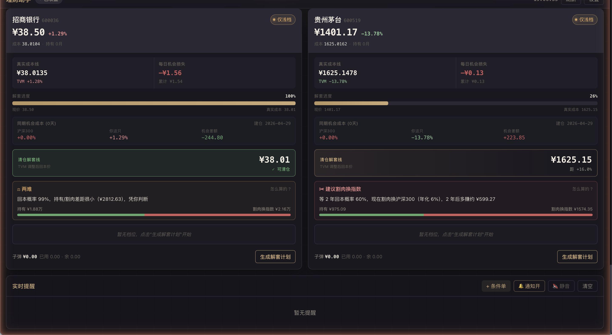

# 理财助手 · licai

> 一个本地化的**个人理财驾驶舱**——把 A股 / 基金 / 银行理财 / 现金账户 / 加密货币 / 量化机器人 全部装进一个看板，再叠加板块对比、配置建议、LLM 早盘简报、解套档位规划等决策辅助。

**没有云端**、**没有账号**、**数据全部跑在你自己的机器上**。SQLite 单文件存储，你随时可以拷走、删掉、备份。



> 演示数据，运行 `python scripts/seed_demo.py --use` 一键重现。

## 为啥做这个

国内散户工具市场两极分化：
- 一头是券商 App / 银行 App，每家给你看自家的资产，**跨平台对账靠手算**
- 一头是 Excel + 雪球记账，**没有任何数据接入和决策辅助**

我自己的需求很简单：**把所有理财头寸装进一个屏幕，看清楚自己的钱在哪、配比合不合理、今天该不该动**。

## 核心能力

### 1. 全资产看板（UnifiedPortfolio）

六大类一站式：
- **A股** — 实时行情，含手续费综合成本（券商 App 口径）
- **基金** — 场内 ETF（实时市价）+ 场外公募（官方净值，跟主流基金平台对齐）
- **理财** — 银行 T+30 锁定型，年化 + 起投日双向估算
- **现金** — T+0 货币基金 + 银行活期，单字段录余额，可选估月息
- **加密** — OKX 现货实时
- **机器人** — OKX 网格 / DCA 自动同步盈亏

附配套：
- 大类饼图 + 子分类小计（基金按"黄金/海外/A股宽基"等聚合）
- **集中度警告** + **同源风险检测**（A股有色 + 基金白银期货 = 同源）
- 加仓 4 模式：按股买 / 本金+净值 / 本金+份额 / 待确认（基金 T+1/T+2）





### 2. 板块雷达

每只 A股 vs **同花顺行业板块**实时对比（90 个细粒度板块自动匹配）：

```
铜陵有色 → 工业金属 | 60 日: 你 -9% / 板块 -7% → α -2% (跑输)
格林美   → 其他电源设备 | 60 日: 你 -7.5% / 板块 -1.2% → α -6% (跑输)
```

### 3. 早盘 LLM 简报

每天 9:00 自动跑（也可手动触发）：
- 拉每只持仓的最近新闻（个股 + 板块）
- 拉 K 线 + 基本面健康度 + 当前档位
- Claude haiku 给出当日 verdict：`锁档 / 观望 / 上调 / 下调 / 立即加仓`
- 飞书一行摘要推送

### 4. 配置建议（AllocationAdvisor）

3 套预设模板（保守 / 平衡 / 激进），显示**当前 vs 目标**配比 + 该加多少 / 该减多少：

| 模板 | 现金 | 理财 | A股 | 基金 | 加密 |
|---|---|---|---|---|---|
| 保守 | 15% | 50% | 12% | 23% | 0% |
| 平衡 | 8% | 30% | 28% | 29% | 5% |
| 激进 | 5% | 12% | 38% | 35% | 10% |

### 5. 基金代理标的（场外基金盘中预判）

天天基金 NAV 是 T+1 公布的，盘中估值不准——所以拉**真实 top10 持仓股的实时涨跌**加权算预判：

```
易方达全球成长 QDII (012922) → top10 持仓加权 -2.42% (覆盖 52% 净值)
  美 TSM 台积电   -3.12% × 8.88%
  美 LITE         -7.92% × 8.68%
  深 300502 新易盛 +0.66% × 6.02%
  ...
```

A股 / 港股 / 美股个股实时报价全部走 Sina 免费接口，无需 API key。



### 6. 解套档位（UnwindView）

针对 A股 套牢仓位的金字塔加仓计划：
- 自动算每档触发价（按 ATR / 历史回撤）
- 健康度门槛（基本面变红时自动锁档）
- NPV 持有 vs 割肉对比（GBM 首达模型算回本概率）



### 7. 风险提醒

- 单板块 > 50% / 70% 警告
- 跨大类同源风险检测（A股 + 基金的隐藏共振）
- 自定义价格条件单
- 飞书 + 浏览器双通道通知，一键静音

## 技术栈

**后端**：FastAPI + SQLite + akshare + Sina API + 东方财富 API + 同花顺 API + Claude API（OAuth）

**前端**：React + Vite + Tailwind CSS + PWA（可装到桌面）

**数据源**（全部公开免费）：
- A股 行情：Sina `hq.sinajs.cn`
- A股 历史 K 线 + 行业：Sina money.finance + EastMoney emweb
- 基金 NAV：天天基金（fund.eastmoney.com）
- 基金持仓：天天基金 fundf10
- 港股个股：Sina hk
- 美股个股：Sina gb_
- 商品期货 / 海外指数：Sina nf_ / hf_
- 行业板块：同花顺（akshare 内置）
- 加密：OKX 公开 ticker
- LLM：Claude API（OAuth via Claude Code 或 ANTHROPIC_API_KEY）

## 快速启动

```bash
git clone https://github.com/<your-name>/licai
cd licai

# Python 后端
python3 -m venv venv && source venv/bin/activate
pip install -r requirements.txt

# 复制配置模板
cp config.example.py config.py
# 按需修改: commission_rate (你的券商佣金率) / patience_years / index_annual_return

# 前端构建
cd frontend && npm install && npm run build && cd ..

# 启动
python run.py
# 访问 http://localhost:8888
```

第一次启动会自动建空 SQLite (`portfolio.db`) 在项目根目录。

### 演示模式（不录数据先看效果）

```bash
python scripts/seed_demo.py --use   # 备份你的 DB + 写入演示数据 (4 只 A股 + 11 笔外部资产)
# 重启服务器, 看演示效果

python scripts/seed_demo.py --restore   # 看完恢复真实 DB
```

也可以 `--peek` 只生成 `portfolio.demo.db` 不动当前 DB。

### 可选：飞书通知

设置 → 飞书 Webhook → 粘贴 URL 保存。所有告警（档位触发 / 基本面恶化 / 早盘简报）会推送过去。

### 可选：OKX 自动同步

设置 → OKX → 填 API Key + Secret + Passphrase（建议**只勾"读取"权限**）。机器人和现货持仓会自动同步。

### 可选：LLM 早盘简报

需要 Claude API 凭证。两种方式：
1. **OAuth**：装好 Claude Code（CLI）登录，会自动从 macOS Keychain 读 OAuth token
2. **API key**：`export ANTHROPIC_API_KEY=sk-ant-...`

不配也能用，只是早盘简报功能停用。

## 项目结构

```
licai/
├── api/                  # FastAPI 路由
│   ├── portfolio_routes  # A股 持仓 / 历史交易
│   ├── assets_routes     # 外部资产 (基金/理财/现金/加密/机器人)
│   ├── unwind_routes     # 解套档位
│   ├── briefing_routes   # 早盘简报
│   ├── sector_routes     # 板块雷达
│   ├── settings_routes   # 飞书 / 风控配置
│   ├── market_routes     # 市场指数 / 节假日
│   └── ws.py             # WebSocket + 后台任务
├── services/
│   ├── market_data       # 行情接口 (Sina/EM)
│   ├── external_assets   # 基金 + 加密 + 期货 + 港美股 quote
│   ├── fund_proxy        # 基金代理标的（top10 持仓加权）
│   ├── fund_holdings     # 天天基金 top10 抓取
│   ├── sector_compare    # 同花顺板块对比
│   ├── morning_briefing  # LLM 早盘简报
│   ├── fundamental_score # 基本面健康度（期货 + 新闻 + LLM）
│   ├── position_ledger   # 综合成本法（含手续费/印花税/过户费）
│   ├── okx_client        # OKX 私有 API
│   ├── feishu_notify     # 飞书 webhook
│   ├── llm_client        # Claude API (OAuth + API key 双模式)
│   └── news              # 新闻抓取
├── frontend/             # React + Vite
├── config.example.py     # 配置模板
├── database.py           # SQLite + schema
├── run.py                # FastAPI entry
└── requirements.txt
```

## 数据隐私

- **所有数据存本地 SQLite**，不上传任何云端
- 实时行情从公开接口拉，**不需要任何账号**
- OKX / LLM 凭证存数据库本地，飞书 webhook 也是
- `portfolio.db` 已在 `.gitignore` 里，不会被 commit
- 备份在 `backups/` 目录每天自动保留 30 天

## 已知限制

- **akshare** 依赖东方财富 API，部分接口（push2.eastmoney.com）会限流，已对这种情况做了 fallback（同花顺 + 硬编码 ETF 兜底）
- **OKX DCA 端点** 文档标"读取"但只读 Key 返 50120（已反馈客服）
- **LibreSSL 老版本** macOS 系统 Python 3.9 用 LibreSSL 2.8.3，跟某些 EM 接口 TLS 握手不稳，已用 subprocess curl 兜底
- 跑在国内非代理环境，海外接口（Claude API / OKX）需要自行处理网络

## License

[GNU AGPL-3.0](./LICENSE)

为啥选 AGPL：这是个**完整应用**而不是库，AGPL 防止有人 fork 后包成 SaaS 卖钱不开源回馈。你 self-host 用 / 个人 fork 改造完全没限制。

## Contributing

欢迎 Issue / PR。因为是个人理财工具，特别欢迎：
- 你自己用着不爽的细节体验
- 新数据源接入（券商对账单导入 / 银行 OCR / 雪球同步）
- 投资组合分析新指标（夏普比率 / 最大回撤 / VaR）
- 国际化（目前只有中文 + A股/港股/美股；如果要做欧洲市场 PR welcome）
