<div align="center">

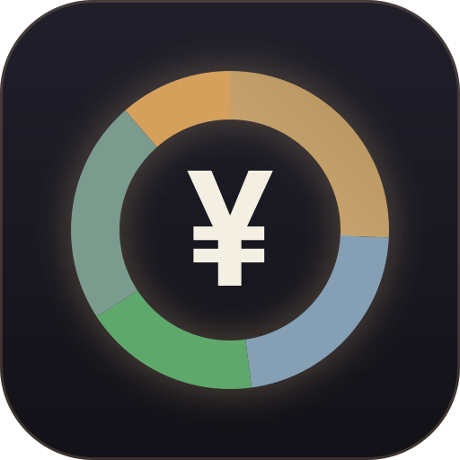

# 理财助手 · licai

**把 A股 / 基金 / 银行理财 / 现金 / 数字资产 / 量化机器人 装进一个看板**

再叠加市场 AI 问答 · 个股详情（K线/盘口/分时）· 全市场榜单 · 板块雷达 · 全球指数 · 早盘简报 · 复盘归因

<!-- badge 必须整行写在一起: 源码里换行会被渲染成一个一列, 排不成横排 -->
[](https://github.com/SnowWarri0r/licai/releases) [](./LICENSE) [](https://github.com/SnowWarri0r/licai/stargazers) [](https://github.com/SnowWarri0r/licai/commits/main)

[](https://www.python.org/) [](https://fastapi.tiangolo.com/) [](https://react.dev/) [](https://www.sqlite.org/) [](#技术栈)

**没有云端** · **没有账号** · **数据全部跑在你自己的机器上**

SQLite 单文件存储，你随时可以拷走、删掉、备份

**只给客观信息，不给买卖建议。**

<a href="#快速启动"><b>快速启动</b></a> · <a href="#功能地图"><b>功能地图</b></a> · <a href="#ask"><b>问问市场</b></a> · <a href="#技术栈"><b>技术栈</b></a> · <a href="#定位与免责声明"><b>免责声明</b></a>

</div>

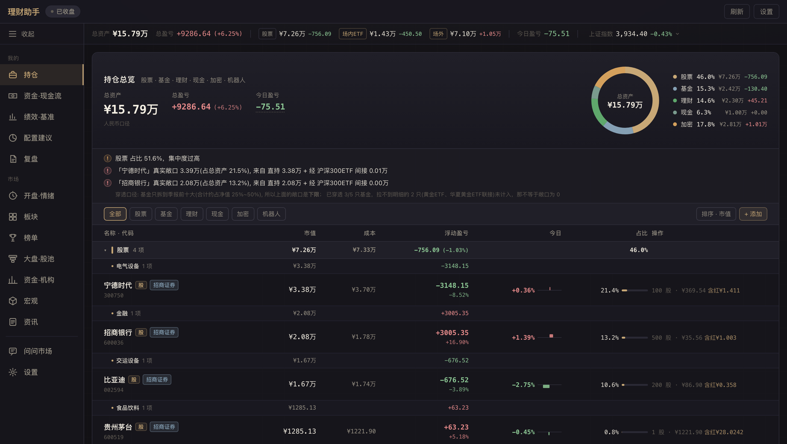

> 演示数据，运行 `python scripts/seed_demo.py --use` 一键重现。

<h2 id="功能地图">功能地图</h2>

| | 模块 | 一句话 |
|---|---|---|
| 🔍 | [问问市场](#ask) | 挂 36 个数据工具的问答 agent，自己决定调哪些工具取数再客观解读（接[知识星球](#zsxq)再 +3） |
| 💼 | [全资产看板](#1-全资产看板unifiedportfolio) | 六大类一屏，含手续费综合成本、份额拆分自动入账、集中度与同源风险 |
| 📡 | [板块雷达](#2-板块雷达) | 每只票 vs 同花顺行业实时 α，外加情绪周期时间轴 + 板块成交份额迁移 |
| 🌅 | [早盘简报 / 收盘小结](#3-早盘-llm-简报--收盘小结) | 9:00 客观信息摘要 + 风险提示；15:10 全组合浮动归因 + 事件区 |
| ⚖️ | [配置建议](#4-配置建议allocationadvisor) | 保守/平衡/激进三套模板的当前 vs 目标差额 |
| 🔮 | [基金代理标的](#5-基金代理标的场外基金盘中预判) | 拉真实 top10 持仓股实时涨跌，补场外基金 T+1 净值的盘中盲区 |
| 📊 | [全市场榜单](#6-全市场榜单八个页签--自由查股--k-线浮层--ai-抽屉) | 八页签 + **概念轮动板**（钱堆在哪条线/谁在接力）+ 券商级 K 线浮层 + 龙虎榜席位画像 + 盘口异动 |
| ⚠️ | [风险提醒](#7-风险提醒客观警示非操作信号) | 集中度 / **基金穿透后的同源敞口** / 基本面红黄灯，只警示不发信号 |
| 📈 | [个股详情页](#8-个股详情页k线--盘口--分时) | 多周期 K 线 + 自己的买卖点 + 五档盘口 + 逐笔成交 |
| 📰 | [资讯流 + AI 解读](#9-资讯流--ai-解读五源合一) | 五源合一，三段式解读「讲了啥 / 为何重要 / 跟你持仓什么关系」 |
| 🩻 | [ETF 题材透视](#10-etf-题材透视避雷雷达) | 用季报真实成分股对照宣称主题，专治挂羊头 ETF |
| 🪞 | [复盘](#11-复盘今日--周--月--总览) | TWR 净值曲线对比沪深300 + 持仓相关性矩阵 + 今日组合归因 |
| 🌐 | [全球指数条](#index-bar) | 顶栏一格切 16 个指数，点开 K线 / 分时；纠了两个停更源的错值 |

## 为啥做这个

国内散户工具市场两极分化：
- 一头是券商 App / 银行 App，每家给你看自家的资产，**跨平台对账靠手算**
- 一头是 Excel + 雪球记账，**没有任何数据接入和决策辅助**

我自己的需求很简单：**把所有理财头寸装进一个屏幕，看清楚自己的钱在哪、配比合不合理、今天该不该动**。

<h2 id="ask">🔍 问问市场 · 市场 AI 问答（独立页）</h2>

一个挂了 **36 个数据工具**（接[知识星球](#zsxq)后 39）的问答 agent，自由问个股涨跌 / 市场风格 / 资金主线 / 产业链 / 自己的成交，它自己决定调哪些工具取数据（并行调用），再客观解读——**只给客观信息，不给任何买卖建议**。流式打字机展示每一步在调什么工具，支持多轮追问（"它明天呢"会顺着上文标的继续）。

**工具覆盖七个维度**

| 维度 | 能问到什么 |
|---|---|
| 行情 / 走势 | 实时报价（含涨停/跌停/炸板/封板判断）+ 近 N 日**裸K量价**与结构形态扫描 |
| 资金面 | 主力资金流、龙虎榜席位明细、席位追踪、机构动向、打板情绪、板块动量矩阵 |
| 业绩面 | 最新报告期业绩预告看板（预喜/预警 + 与你持仓的关联） |
| 基本面 / 公司画像 | 营收净利 ROE PE/PB（A/港/美）+ 主营与实控背景 + **客观红线清单** |
| 消息面 | 个股新闻、结构化公告、宏观快讯、联网搜索 + **read_url 读网页全文** |
| 我的持仓 | 成交流水、综合成本、已实现盈亏、持有天数、做T识别、买入逻辑复盘 |
| 产业链全景 | 问「X 产业链上游到下游」→ 联网拿各环节代表公司 → 批量量价一览表 |

<details>
<summary><b>行情 / 走势</b>：裸K量价具体给哪些字段</summary>

- 每日开 / 收 / 高 / 低位置 + **量比**
- **单根 K 线形态**：光头光脚阳 / 长上影十字…
- **结构形态扫描**：头肩顶底 / 双顶 / 收敛三角 / 跳空缺口 / 量价背离 / **2B 假突破·假破位**
- **多周期摘要**：5d/20d/60d 涨幅、距 20 日高、均线排列

</details>

<details>
<summary><b>资金面</b>：能回答哪几类具体问题</summary>

| 工具 | 回答的问题 |
|---|---|
| 主力资金流 | 超大 / 大 / 中 / 小单净额 + 近几日趋势 |
| 龙虎榜席位明细 | 「那天谁在买谁在砸」——营业部名称 / 金额 / 占成交比 + 席位画像（机构 / 北向 / 知名名号 / 量化通道） |
| 席位追踪 | 「大佬说 XX 进场了帮我看看」「这个席位胜率如何」——传名号或营业部名，出近 90 天上榜明细 + 净买后 1/5 日红盘率 |
| 机构席位动向 | 「机构接在山顶还是跑对了」——近 30 天净买/净卖榜 + 距上榜日至今涨跌 |
| 打板情绪 | 涨停 / 连板 / 炸板 + 全市场涨跌家数（含沪深北分市场）+ **涨跌分布直方图**（每 1% 一档，看下跌集中在哪个深度） |
| 板块动量矩阵 | 带量价配合判**真上升趋势 vs 虚涨**，趋势窗口 5/10/20 可调 |
| 其他 | 同行横向对比、筹码面（十大流通股东 + 北向增减 + 解禁抛压）、热门概念榜、资金人气榜 |

</details>

<details>
<summary><b>其余四个维度</b>的细项</summary>

- **业绩面** — 个股问答时自动带业绩预告凭据
- **基本面 / 公司画像** — **公司画像**：主营业务 + 细分行业 + 主营构成 + 控股/实控背景（判国资 / 央企 / 中科院系 / 民营）；**客观红线清单**：监管处罚 / 退市 / 业绩预亏 / 商誉减值 / 问询 / 减持 / 解禁抛压扫描
- **消息面** — 宏观快讯合了东财 + 财联社 + 同花顺 + 金十；`read_url` 把搜到的研报原文读全再下结论，免 key。A/港股走东财，**美股换 Yahoo**（东财的美股关键词搜索会返回几天前的旧稿，异动归因看的就是时点）
- **美股也有一手材料** — 公告走 **SEC EDGAR**，按 8-K 的 Item 编号说清是哪类事（1.01 重大协议 / 3.02 增发…），而不是只报个表单号；同业对比走 Yahoo 的相关标的
- **我的持仓** — 覆盖个股 + 场内 ETF + 场外基金（份额拆分自动折算），可按日期区间筛；含**全资产配置问答**（现金/理财框架 + 现状分析）与**ETF 题材透视**（问「我的 ETF 挂没挂羊头」直接出逐股贴题）
- **产业链全景** — 一览表列 环节 / 标的 / 角色 / 均线 / 5d / 60d / 距20高 / 量能，一眼看清整条链强弱分布

</details>

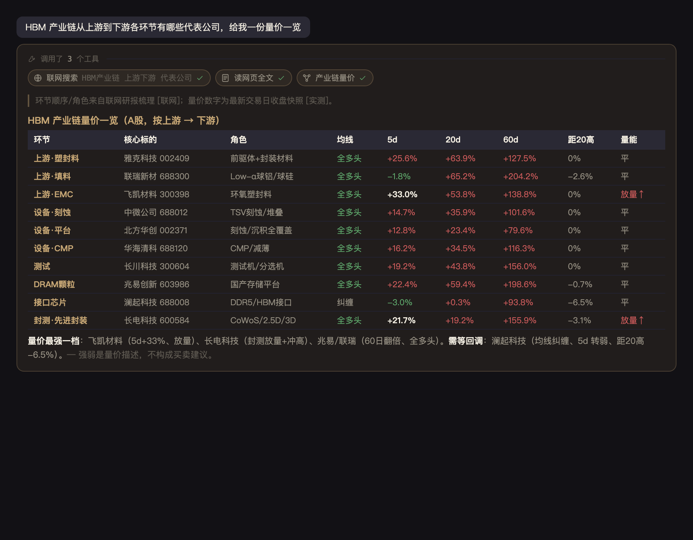

几条贯穿的"读盘原则"（来自实战反馈，固化进 agent）：

- **裸K量价为主轴，资金流只作线索** — 当下拆单 + 多子账户操作让"超大单=主力"的分档失真，所以以价格行为 + 量能为准，资金净流入只当参考，背离时点明
- **可信度分级 + 可溯源** — 关键数字标 `[实测]`（本地工具）/ `[联网]`（搜到的，带来源时间）/ `[待核实]`（仅记忆）；接了[知识星球](#zsxq)则多一档 `[星球观点]`（社群里某个人的看法，不作为数字依据）。联网结论正文带**可点角标**，点击直跳原文核实，底部列完整来源
- **分清"正在发生"和"背景脉络"** — 几个月前的旧政策不冒充"这两天在炒"，行情数据周末锚定到最近交易日（不说成"今日"）
- **美股分时段说清楚** — 盘前/盘后的价格与正股时段的收盘价是两个时点，答案里分开写（"收盘 216.00 −7.8%，盘前 240.56 +11.4%"），不混成一个涨跌
- **严格不输出操作建议** — 描述"市场在奖励动量"可以，绝不说"所以你该追"；方向性进出永远留给你自己定

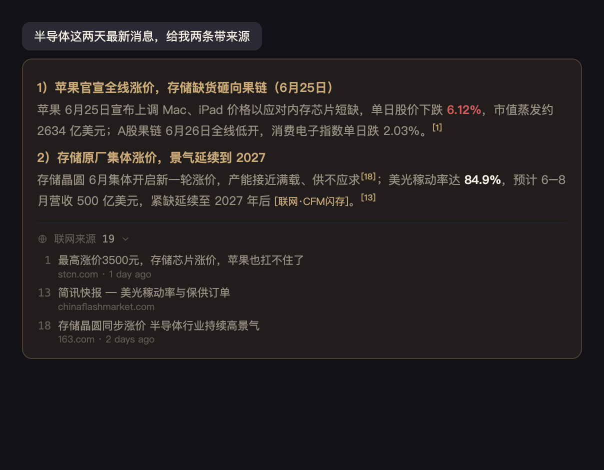

<details id="ask-run">
<summary><b>切走了那一轮还在不在</b>：跑在服务端，不挂在这个页面上</summary>

问一句要跑十几秒到一分钟（agent 要串好几轮工具）。这段时间里切到别的页、关掉抽屉、刷新、甚至关掉页面——**那一轮都照跑，答完自己落库**，回来接着看，没回来也能在历史里翻到。

原来不是这样，而且是两层原因叠在一起（只改一层现象还在）：

- **执行权在浏览器**：切页 → 组件卸载 → `abort()` → 客户端断开 → 服务端的响应任务被取消，agent 在下一个 yield 处就地死掉。拿最小探针实测过：客户端一走，生成器当场 `CANCELLED`
- **落库在最后一步**：会话是"存第一条消息"时才建的，而前端要等完整答案才存。一轮没答完就一行都不写——所以历史里连"我问过什么"都没有

现在开跑就建会话并把问题写进去（历史里立刻看得到），agent 在独立任务里跑到底，事件按序进缓冲，前端拿游标拉、断了照游标续拉。前端断开只是"不看了"。

- 走开不杀，所以给了明确的**「停」**；「新对话」只是不看了，它会自己跑完进历史
- **过程也落盘**（`ask_run` 表，答案照旧进 `ask_message`）：服务重启（改代码 / 掉电）那一轮确实会死——asyncio 任务不可能跨进程活下来——但它跑到哪一步还在。启动时把上一进程留下的 `running` 全标成 `interrupted`，**不自动重跑**（重跑要再烧一遍 token，该不该跑由人决定）；再去跟看那一轮，会重放已经跑出来的步骤，末尾明说「跑到一半服务重启了，没跑完」再收尾，不让界面一直转
- 事件落盘按 0.5s 合并窗口写（每条都写就是一轮几十次开关连接），收尾必写

> 拿 `kill -9` 实测过：被杀时盘上是 `running` + 已落的事件；重启日志打出「上次没跑完的 agent 轮次 1 条, 已标记为中断」；再跟看那一轮，拿到已跑出的步骤 + 中断说明 + done。

</details>

<details>
<summary><b>答错了怎么不再错第二遍</b>：回归评测集 + 纠正沉淀 + 缺口台账</summary>

prompt 里已经堆了几十条读盘原则，靠"再加一句嘱咐"来修 bug 的边际收益越来越低，而且改动无法验证——所以做了四件配套的事，全部离线、不影响正常问答：

| 机制 | 做什么 |
|---|---|
| **回归评测集** | 每个用例来自一次真实答错：现取行情算出**硬断言**（比如"当前是跌，所以答案里不能出现'现在涨'"），再判 agent 的回答过不过。`python -m evals.run` 跑全量（默认对着演示库，不碰真账本），`--list` 看用例清单 |
| **运行时自检** | 答案成型后先过一遍确定性检查（美股时段标注 / 用了旧新闻却没联网 / 指数编出成交额 / 出现买卖指令 / 漏出 HTML 标签），命中就把问题回灌给模型重答一轮。与评测集共用同一份判据 |
| **纠正沉淀成规则** | 从历史对话里挖"用户在纠正我"的三元组（问题 → 回答 → 纠正），起草成候选规则进待审队列。**每周一自动挖一次**（一次最多起草 3 条），在**设置页 → AI 读盘规则**里逐条批准/否决，也可 `python scripts/rules.py`。**批准了才进 prompt**，待审的一条都不生效 |
| **工具缺口台账** | 工具返回报错 / 空 / 过期（按交易日算，不按日历天）/ 关键字段全 0 时记一笔，`python scripts/tool_gaps.py` 看排行——"哪个市场缺哪类数据"有账可查，而不是等下次答错 |

闸门是刻意的：prompt 对单个词都敏感（曾因词表里缺"主题/标题"两个词让模型吞掉整句首句），自动往里加规则最容易造成规则互撞。所以只自动**提案**，不自动生效；否决的也留着，下次挖掘不会把它原样再提一遍。

两个踩出来的细节：

- **失败的答案当场落盘**（`logs/eval-fail-<用例>.txt`），断言消息带上命中处的原文。因为一条用例跑一次要十万 token 且答案不稳定——实测同一条"一次挂一次过"，靠回头重跑分不清是真答错还是断言写歪了
- **断言别用裸子串**。「涨跌」里含「跌」、「公司在未上市阶段」里含「未上市」，两次误报都是这么来的

</details>

## 核心能力

### 1. 全资产看板（UnifiedPortfolio）

**六大类一站式**

| 大类 | 取价 / 口径 |
|---|---|
| A股 | 实时行情，含手续费综合成本（券商 App 口径） |
| 基金 | 场内 ETF 走实时市价，场外公募走官方净值（跟主流基金平台对齐） |
| 理财 | 银行 T+30 锁定型，年化 + 起投日双向估算 |
| 现金 | T+0 货币基金 + 银行活期，单字段录余额，可选估月息 |
| 数字资产 | 交易所现货实时 |
| 机器人 | 交易所网格 / DCA 自动同步盈亏 |

基金这块有两件容易算错、这里做对了的事：

- **份额拆分自动检测入账** — 对比原始 / 前复权日 K 探测拆分因子，份额 ×N、单价 ÷N，零盈亏
- **盈亏用摊薄成本口径** — 减仓已实现摊进持仓成本，隔夜清仓重置，跟券商 App 逐分对齐
- **场内 ETF 与场外基金分开算、分开标** — 前者在交易所按市价 + 券商佣金成交，后者按 T+1 净值申赎，顶栏与 AI 问答都按各自的名字表述，不混成一个「场外」

**附配套**

- 大类饼图 + 子分类小计（基金按「黄金 / 海外 / A股宽基」等聚合）
- **集中度警告** + **穿透同源检测** —— 基金拆到季报前十大，直持与间接持有的同一标的合并计算；实测能挖出「两只基金前十大重叠 36%，等于下同一注」「同一只票经 5 只基金间接持有」这类靠名字看不出来的重复下注
- 加仓 4 模式：按股买 / 本金+净值 / 本金+份额 / 待确认（基金 T+1/T+2）


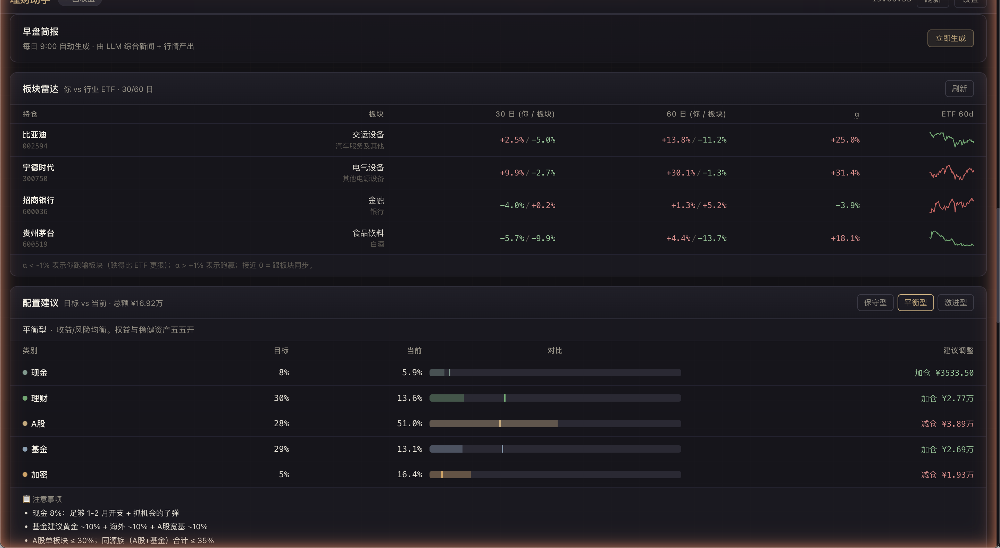

### 2. 板块雷达

每只 A股 vs **同花顺行业板块**实时对比（90 个细粒度板块自动匹配）：

```
铜陵有色 → 工业金属 | 60 日: 你 -9% / 板块 -7% → α -2% (跑输)
格林美   → 其他电源设备 | 60 日: 你 -7.5% / 板块 -1.2% → α -6% (跑输)
```

同页还有两件市场级参照，都是**逐交易日收盘定格进 SQLite**、越攒越长：

**情绪周期时间轴**（在情绪温度计里）

近 30 交易日四条序列叠在一起：涨停（上柱）/ 跌停（下柱）/ 赚钱效应（折线）/ 最高连板高度。情绪处在 冰点 → 回暖 → 高潮 → 退潮 哪一段，一眼可见。

**板块成交份额**

90 个行业占全市场成交额的比重排行，外加较昨日 / 5 日的**份额迁移**。涨跌幅会骗人，成交占比往哪挪更接近资金真实走向——份额升但板块跌 = 放量分歧。

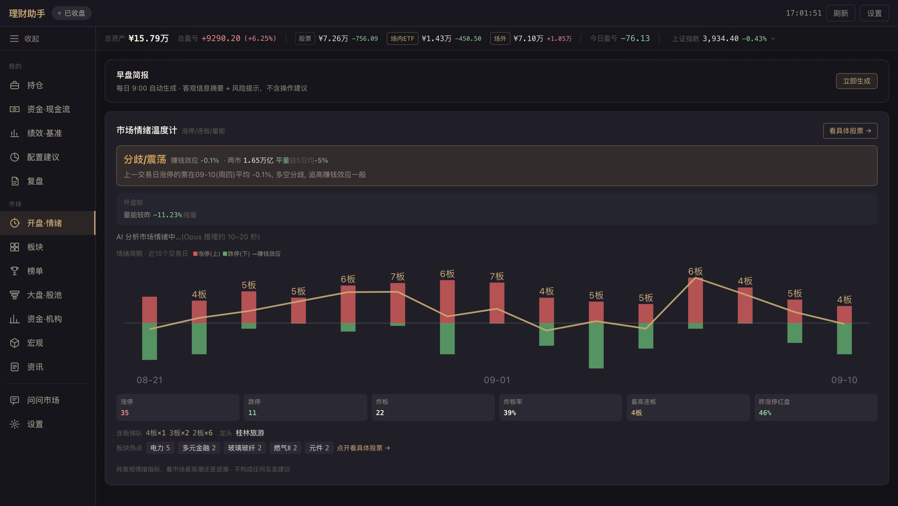

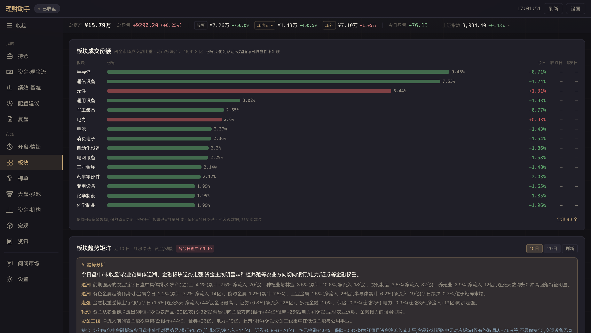

### 3. 早盘 LLM 简报 + 收盘小结

**早盘简报**：每天 9:00 自动跑（也可手动触发）。基于每只持仓的近期新闻 + 公告 + K 线 + 基本面健康度，给一份**客观信息摘要 + 风险提示**——**不给任何操作建议**：
- `signal`：偏暖 / 中性 / 偏冷 / 警惕（只描述消息面倾向，不是买卖指令）
- 一句话点出今天最该知道的事 + 2-4 条客观要点（新闻/公告/基本面/技术位）
- 明确风险（业绩雷 / 监管 / 板块利空 / 股东减持 / 技术破位）单独标出
- 按个股真实行业拉对应板块新闻；**场内 ETF 也覆盖**（按主题词拉消息，侧重政策/资金/产业链）；飞书推送

**收盘小结**：交易日 15:10 自动生成，纯数据拼装不走 LLM，三块内容：

- **今日浮动按贡献排序** — 全组合口径（A股 + 场内外基金 + 加密）。场外基金净值滞后时用底层实时估并标注「按底层估」，估不出的单列说明、不冒充
- **事件区** — 持仓/自选上龙虎榜、涨停跌停、业绩预告当日披露
- **大盘一行** — 涨跌家数 / 涨停跌停 / 情绪定性

配了飞书就推飞书；没配也一样用——**复盘页「今日」有同一份的站内卡片**。

### 4. 配置建议（AllocationAdvisor）

3 套预设模板（保守 / 平衡 / 激进），显示**当前 vs 目标**配比 + 该加多少 / 该减多少：

| 模板 | 现金 | 理财 | A股 | 基金 | 加密 |
|---|---|---|---|---|---|
| 保守 | 15% | 50% | 12% | 23% | 0% |
| 平衡 | 8% | 30% | 28% | 29% | 5% |
| 激进 | 5% | 12% | 38% | 35% | 10% |

### 5. 基金代理标的（场外基金盘中预判）

天天基金 NAV 是 T+1 公布的，盘中估值不准——所以拉**真实 top10 持仓股的实时涨跌**加权算预判：

```
易方达全球成长 QDII (012922) → top10 持仓加权 -2.42% (覆盖 52% 净值)
  美 TSM 台积电   -3.12% × 8.88%
  美 LITE         -7.92% × 8.68%
  深 300502 新易盛 +0.66% × 6.02%
  ...
```

A股 / 港股 / 美股个股实时报价全部走 Sina 免费接口，无需 API key。

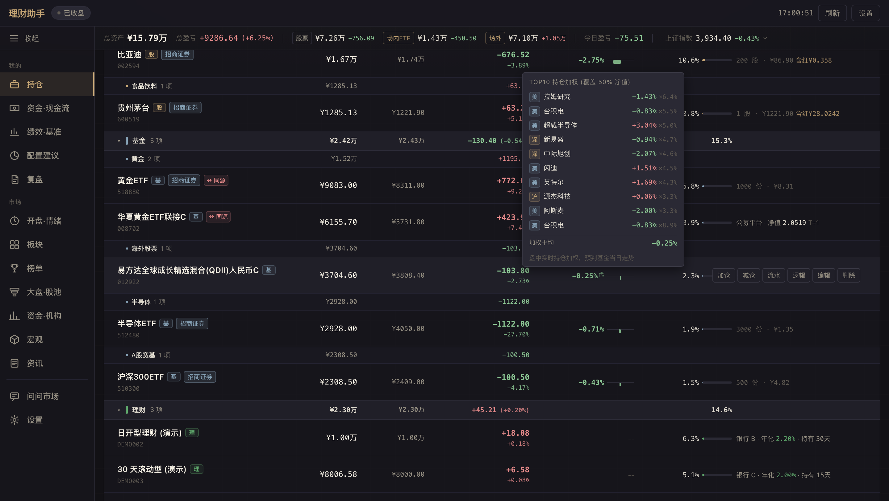

### 6. 全市场榜单（八个页签 + 自由查股 + K 线浮层 + AI 抽屉）

左侧榜单 + 右侧 K 线，`↑↓` 翻股、`←→` 切分类，想问再唤起 AI。头部有**自由查股搜索框**：输入代码 / 名称 / 子串出候选（带实时涨跌），选中即进右侧同一套面板——不限榜单里有没有它。

**八个页签**

| 页签 | 看什么 |
|---|---|
| 观察池 | 在看未必持有的票，**按自建分组管理，一票可同时属于多个组**：今日涨跌 / 自选以来涨跌 / 当下 K 线结构形态 / 业绩预告徽章 |
| 盘口异动 | 交易所 22 类异动事件流，盘中 60s 自动滚动 |
| 涨幅榜 | 按**涨停占比**排（涨幅 ÷ 该板块涨停幅度），主板 10% 板不被 20% 板挤光；带**轮动板** |
| 成交额榜 | 当日资金最集中的方向；带**轮动板**（今天的钱堆在哪条概念线上、谁在接力谁在退潮） |
| 龙虎榜 | 最新披露日全部上榜个股，点开看买卖前五席位与席位画像 |
| 蓄势/强势 | 龙头池里两类「结构完好」的票，按行业分组 |
| 机构 | 机构专用席位近 30 天买卖统计，主数字=现价较最近上榜日涨跌 |
| 业绩 | 最新报告期预喜/预警榜 + 持仓关联 |

<details>
<summary><b>观察池</b>：分组怎么组织、持仓怎么并进来</summary>

分组是顶层视图，chip 条切换：`全部 / 持仓 / 各自建分组 / 自选`。

- **一票多组** — 「兴业银锡」可以同时在「金矿」和「博弈」里。行上显示它还在哪些别的组，切到某个组时不重复显示当前组
- **「自选」是一个真实分组**，跟自建的组平级——勾上「金矿」不会把「自选」顶掉，一只票可以**同时在「自选」和「金矿」里**。它只有两处特殊：☆ 加进来时默认落它、取消到一个组都不剩时退回它（否则这只票只在「全部」里看得到，等于丢了，所以最后一个组不给取消）
- **组内顺序各组一份** — 在「金矿」里拖动排序，不影响这只票在「博弈」里的位置，也不影响「全部」的顺序
- **持仓自动并进来**（虚拟组，现取现算，清仓即消失）：显示浮盈与持有天数，不占用分组
- 归组不刷新榜单——翻到半截去归个组，滚动位置不会被打回顶部
- 记住上次看的那一组；那个组后来被清空了则退回「全部」

</details>

<details>
<summary><b>轮动板</b>（涨幅榜 / 成交额榜）：一张榜 100 只票，看不出钱在哪条线上</summary>

榜单一行原来只有一级行业（「元件」「通信设备」），看不出今天涨的是 CPO 还是 PCB——**轮动发生在概念这一层**。所以把同一张榜按概念/行业聚成堆，做成榜单顶部一条**常驻、可收起**的板：

- **一条线一行**：几只上榜 / 几只涨停 · 成交额条形（粗细一眼可比）· 均涨幅 · **份额五日迷你走势** · 较上一日的变化 ↑↓ · 领头三只（点了直接看 K 线）
- **常驻顶部**所以能边看某只票的 K 线边盯轮动；收起后留一行摘要 chip（仍然可点筛榜——收起是为了省地方，不是把功能也收走），开合记在本地
- **点一条线**把左边的榜筛到这条线的票；行内也标出这只票进了今天哪几堆（只标前十堆的——一只票挂三四十个概念，实测中天科技 47 个，全列等于没列）
- **结论看份额不看绝对值**：全市场放量时每条线的成交额都涨，只有「占榜单成交额的比重」才说明钱在往哪挪

三处不肯含糊的地方：

- **概念标签先洗**：东财的概念串里混着交易资格（融资融券/深股通）、指数成分、注册地（长江三角）、汇率（贬值受益）。不洗的话排最前的就是这些全市场都有的标签，真主线被挤下去。供应链概念（华为/英伟达/小米）保留——那是 A 股轮动的主要形式
- **同义并成一行**：实测某日成交额榜前十里，通信技术(42家) 与 5G概念(37家) 说的是同一批光模块票，四行占掉半个榜，看着像四条主线其实是一条。按 Jaccard 判同名，阈值 0.75 是量出来的（真同义那对 0.80，下一对 CPO概念 vs 光通信模块只有 0.57，后者不能并——「光通信模块」比「CPO」更具体）
- **覆盖不够就不给结论**：几日走势用本地日线缓存算（东财的板块日K 在开发机上连不上，连仓库里已在跑的个股日K 也被掐，所以不拿它当地基）。实测涨幅榜 100 只里只有 8 只有本地日线——拿两三只票代表一条十几只票的线还标「在退潮」，那是编的。所以单条线成分不足 3 只或不到一半不出曲线、整张榜覆盖不到三成一条都不出，并在界面上说清是覆盖不够；收盘后自动补齐缺的日线，几天后涨幅榜那侧也能出

另外两个防骗人的细节：篮子必须一致（某只票缺一天就整只剔掉，否则那天凭空少一块会被读成「资金退潮」）；盘中会标「今天还没收盘，最后一格是半天的量」。

</details>

<details>
<summary><b>盘口异动</b>：22 类事件怎么分组、每行给什么</summary>

- **事件类型**：火箭发射 / 高台跳水 / 大笔买卖 / 封板·开板 / **竞价异动**（9:15-9:25 高开低开、竞价抢筹压价）/ 缺口 / 60 日新高低
- **分组**：先按 拉升 / 跳水 / 竞价 分组，组内可按具体类型细分（chip 带全天计数，`←→` 循环切换）
- **每行**：按类型解析的**关键幅度**（急变速度 / 封单手数 / 大单金额）+ 反复触发的 **「今日 n 次」角标**（烂板反复挣扎一眼可见）
- **底部三件套**：今日最活跃（全天反复异动 top6，点名字进 K 线）、全天脉搏分布图（5 分钟一档拉升红 / 跳水绿双向柱）、近 30 分钟拉升 vs 跳水计数

</details>

<details>
<summary><b>龙虎榜</b>：席位画像与席位追踪</summary>

- 上榜个股按净买额排序，带东财解读 / 换手
- 点任意一只**直接弹开该日买卖前五席位浮层**：营业部名称、金额、占成交比
- **席位画像**：机构 / 北向 / 知名席位名号 / 常见量化通道，名号表 `data/seat_names.json` 可自行维护
- **席位名可点**：弹出该营业部近 90 天上榜明细（股票 / 净额 / 上榜后 1·5·10 日涨跌）+ 净买后红盘率统计——「这个席位最近手风如何」有数可查

</details>

<details>
<summary><b>蓄势 / 强势</b>：两类结构的判定规则</summary>

池子 = 全市场龙头池（百亿市值 + 机构持仓 + 盈利），**按行业分组**展示：同行业强势多 = 主线在推进，蓄势多 = 可能在孕育。

- **强势** = K 线没砸下去：距 60 日高 ≤12%、近 10 日无大阴、上行结构未破位、不跑输沪深300
- **蓄势** = 安静横盘基座：窄幅 / 缩量 / 横盘 ≥45 日，规则闸过了再交 **AI 看图复核**
- 每只带业绩预告凭据

纯结构描述，随时可能被砸。

</details>

**K 线浮层**

券商级可缩放蜡烛图：量 + MA5/10/20/30/60 彩色图例 + 昨收线 + 跳空缺口阴影 + 悬浮涨跌%。**点任意蜡烛出「分时›」提示，再点弹出浮层**，两个页签：

- **分时图** — 当日实时 + 历史分时，走[通达信数据源](https://github.com/SnowWarri0r/tdx-api)
- **龙虎榜席位** — 某日没上榜时直接列出这只票最近的上榜日，窗口内一键跳转

历史分时的昨收基准做了**除权精确还原**：K 线是前复权价、分时是当日真实成交价，除息日之后回看会错位出「主板 +13%」的假涨跌。这里用分红送配明细逐事件逆变换（派息加法 / 送转乘法），基准标注「除权校正·精确」；事件表拉不到时退近似口径并如实标注。

任意一只点「问 AI」唤起对话抽屉，agent 自取数据后客观解读，跟「问问市场」同一套工具。关掉抽屉它照跑（见下方[「切走了那一轮还在不在」](#ask-run)），重开接着看。

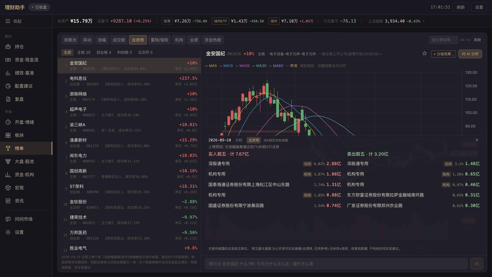

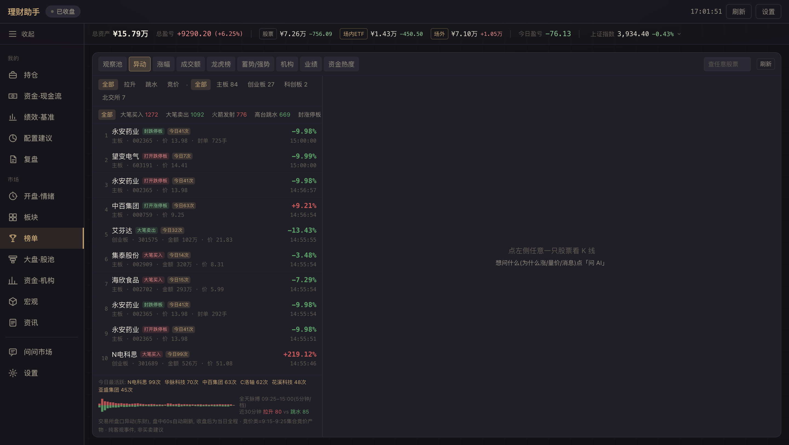

### 7. 风险提醒（客观警示，非操作信号）

- 单板块 > 50% / 70% 集中度警告
- **穿透同源风险**：把持有的基金/ETF 拆到季报前十大，把直持个股与基金间接持有的同一标的合起来算，再按行业归并
  - 只按名字看板块会漏：「兴业银锡」名字里没有金属字样，基金名也不说它到底拿了什么票。实测这个账本，穿透后才看得见「贵金属 38.6%」、「易方达信息行业精选 与 易方达信息产业混合 前十大重叠 36%（买两只 = 下同一注）」、「台积电 经 3 只 QDII 间接持有（其中一只同时拿 ADR 与台股，敞口已合并、来源不重复计）」
  - A/C 份额自动并成一只——不并就会报出「两只基金重叠 45%」这种废话
  - **行内的 ↔同源 角标也按穿透后的行业打**，不再看名字：「兴业银锡」和「山东黄金」在东财行业里同是贵金属，本来就是同一块风险，但名字里一个金属字都没有——关键词那套只给山东黄金挂角标，银锡干干净净，看着像两注不相干的仓。穿不动明细的基金（黄金ETF联接这种）按名字兜底挂进来，但**不并进那个量出来的金额**，单列「另有 X 万拉不到明细，未计入」
  - 角标带一句「这几行是同一块风险」并列出还有谁；一行在家族里不足总资产 0.5% 不标（债基前十大混进一只光模块 392 元也标就成噪音了）
  - **能回看某一天**（`?as_of=YYYY-MM-DD`）：敞口按当下持仓算，已清仓的票根本不进来——而复盘时想问的恰恰是它。实测 8-25 清掉山东黄金 + 兴业银锡之后，当下的穿透里那块 38.9% 的贵金属一点痕迹都没有。回看时 A股**回放账本**（截到当天）× 当天收盘，基金/理财/现金取当天或之前最近一条组合快照；快照写于 15:05，当晚才补录的成交它不知道，所以持股清单一律以账本为准。用的哪天、哪些票缺当天收盘价，都写在 `basis` 里，`warnings` 首条也标出这是回看
  - **口径写在结论旁边**：前十大合计只占基金净值 25%~50%，所以给的是**下限**；拉不到明细的（联接基金/债基）单独列出，不当成敞口为 0；回看时用的季报与行业表都是**现在**这一份（回看几周内没差，更早会失真）
  - 同一份口径供三处用：看板提示带、`/api/portfolio/exposure`、agent 的 `get_exposure` 工具
  - 与相关性矩阵分工：这个是**结构**同源（底层就是同一批票），相关性是**统计**同源（走势一起动）
- 基本面健康度红/黄灯
- 早盘简报里的风险项（业绩雷 / 监管 / 减持 / 技术破位）单独标出，飞书推送

> 注：早期的"实时价格条件单 / 解套提醒"模块已下线——实测下来，低吸/做T 类的提示性推送反复打脸，**客观看板 + 警示信息**才是真正有价值的部分，所以收敛到只做客观呈现、不做提示性信号。

### 8. 个股详情页（K线 + 盘口 + 分时）

任意 A股 / 场内 ETF 持仓点开看专业详情页：

- **多周期 K 线**（日 / 周 / 月）：蜡烛 + MA5/10/20 + 成本线 + 可切换 量 / MACD / KDJ 副图
  - 图上标**自己的买卖点**（B/S，精确到成交时刻）。同一张委托分几个价位成交的，合成一个标记标 `B×3`（否则圆点与字母原地叠印成一团），均价按成交额加权，明细留在悬浮框里逐笔列出
  - **上下两图光标联动**：悬到任意一根，K线与量能同时亮同一根，两行图例一起给出该日 OHLC 与量/额
  - K 线走**前复权**，**除权与份额拆分自动折算到同标度**——不再断崖，拆分前的买入点照样贴得准
- **当日分时**：价 / 均价线 + 昨收基准 + 成交量按主动买卖着色（红买绿卖）+ 09:30 开盘点
- **五档盘口**（封单 / 内外盘，5s 刷新）+ **逐笔成交**（同价归并、大单高亮）
- 数据源可插拔：**分时 / 周月 K 线 / 五档盘口 / 逐笔成交**这四样走自部署的 [通达信协议服务](https://github.com/SnowWarri0r/tdx-api)（配法见[可选：通达信数据源](#tdx)）。不启用也能用，详情页会收敛成只有「日」一个页签

成交记录还支持**精确到时分**录入、**每笔各记券商**（同一只票跨券商分别按各自费率算手续费）。

### 9. 资讯流 + AI 解读（五源合一）

五个来源一个页面切换：**全球宏观快讯 / 持仓个股新闻 / 市场要闻 / 商品产业 / 事件日历**。**重要**高亮，**关联我持仓**一键筛选（关联词覆盖场内 ETF 的主题，不只个股名）。

- **三段式 AI 解读** — 任意一条点开，讲 **讲了啥 / 为何重要 / 跟你持仓什么关系**，带你的全部持仓上下文（A股 + 基金 + 数字资产 + 机器人），**只解读不荐买卖**
- **事件日历** — 持仓相关的未来已知事件时间轴：财报预约披露日 / 除权除息 / 解禁。覆盖 A股直持 **+ 场内 ETF 前十大成分股**，所以「寒武纪 8-08 披露中报、经由科创50ETF 持有」这种提前量不用等资讯里刷到
- **原文抓取** — 走 DOM 级正文提取（按段落密度定位正文容器，导航 / 页脚 / 推荐位噪声进不来），JS 渲染页自动回退远端渲染抓取

### 10. ETF 题材透视（避雷雷达）

用基金**季报真实成分股**对照名称宣称的主题，算「主题匹配权重」——专治「标榜红利/电器、实际重仓别的」那类挂羊头 ETF。

- **逐股判定只认行业不认名字** — 股票名带「通信」但行业是消费电子，照样判偏题。名字挂羊头正是这个工具要抓的对象
- **基金名自动分四型** — 行业主题算贴题%（贴题 / 有偏离 / 偏离显著三档警示）；宽基指数、风格策略、跨境商品债天然多行业，只展示分布不打分
- **不给假安心** — 主题比行业分类更细时（半导体设备 / 创新药）明确标注「只验证到大类」
- **按主题查** — 输入「创新药」只对比该主题规模最大的前 N 只（小规模 ETF 流动性 / 清盘风险另算，不进对比池）

数据 = 基金季报（滞后至上季度末），纯客观结构展示。

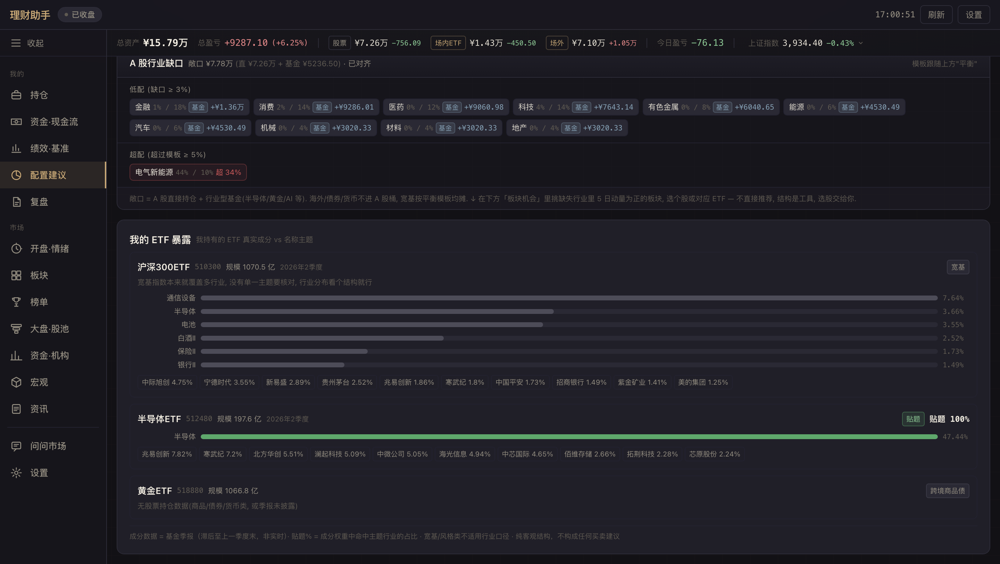

### 11. 复盘（今日 / 周 / 月 / 总览）

**组合净值曲线**（总览页）

从流水 + 行情历史逐日重建组合市值，画 **TWR 时间加权收益**曲线对比沪深300、同起点归一到 100 ——「我到底跑没跑赢大盘」一眼见分晓。

- TWR 把**出入金剥离**了，与基金净值同口径：中途加仓不会被当成赚了，减仓不会被当成亏了
- 带区间收益 / 最大回撤 / 超额收益，份额拆分自动折算同标度
- **每日收盘快照**逐日定格真实市值，历史越走越准
- AI 复盘直接引用这组 TWR 数字定性，不另算一套

**持仓相关性矩阵**

在持标的两两日收益相关性 + 各自对沪深300。同源风险从「感觉像」变成数字——实测科创半导体 ETF × 半导体设备 ETF 相关性 **0.99**，等于一个仓。

**今日组合归因**

全组合口径（A股 + 场内外基金 + 港美股 + 数字资产 + 机器人）：谁在动、动多少、消息面有没有对应解释，一屏讲完。顶部**收盘小结卡片**与 15:10 飞书推送是同一份数据，没配飞书也随时可看。

**周期统计与 AI 复盘**

- 胜率 / 盈亏比 / 平均持有天数 / 做T识别，**A股与基金 ETF 一并统计**（份额拆分不算买卖，不污染胜率）
- **一次委托的分笔成交合成一笔**再评：实测同一分钟的 200股@34.93 + 100股@34.94 是一次决策的两笔成交（账本里一条建仓一条加仓），不合的话 AI 复盘会点评「同日拆成两笔买…更像是一次决策被拆成两下手」——它点评的是记录方式，不是交易行为；「做T最频繁 N买N卖」「当前轮 ≥3 笔买入=反复补仓」这些计数也会跟着翻倍。判据故意收窄：同日 + 同标的 + 同方向 + 与首笔价差 ≤0.3% + 间隔 ≤10 分钟，真追高（34.9 买完 36.5 再买）、同日买了又卖、隔几小时的第二次决策一个都不合
- **当日复盘带上「那天的同源结构」**（穿透后按行业归并，走上面的回看口径）：以前只能说"你又加仓了浮亏票"，现在能说清这一笔把敞口堆到了什么程度——实测它写出「同一天两次买入，第二笔还买得更高，而这只穿透同源结构后一家就占了近 38% 的敞口」。限定成事实陈述，不给方向
- AI 复盘按你的资金形态（固定资金 vs 复利增值）讲纪律一致性，只评过程不指方向

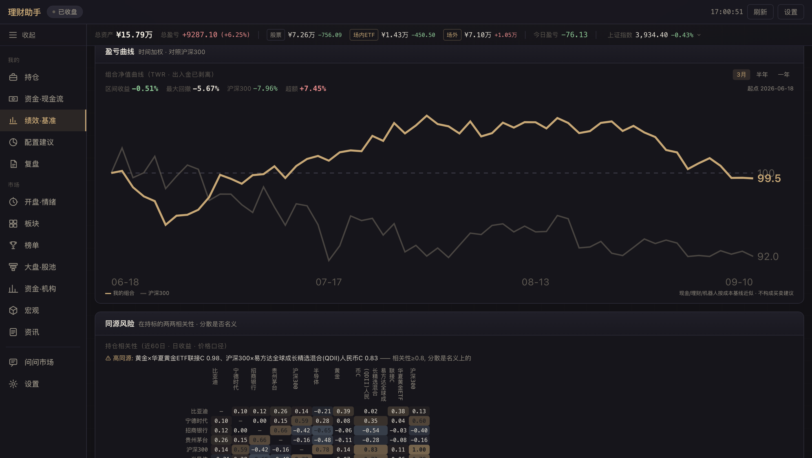

事件日历（资讯页第五源）：

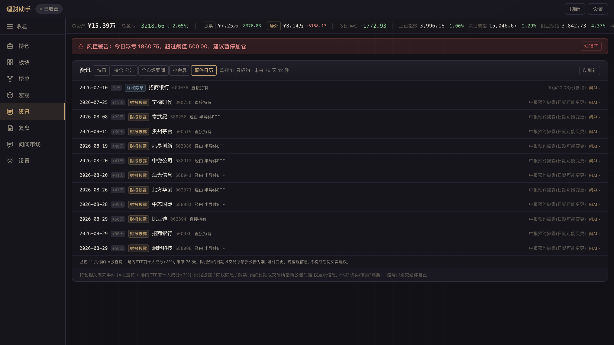

<h3 id="index-bar">12. 全球指数条（顶栏一格 · 16 个指数）</h3>

顶栏只占一格（选哪个记在本地），点开是 K 线 + 分时，面板顶部横向滚动条换指数——A股宽基 → 港股 → 美股 → 日韩欧。

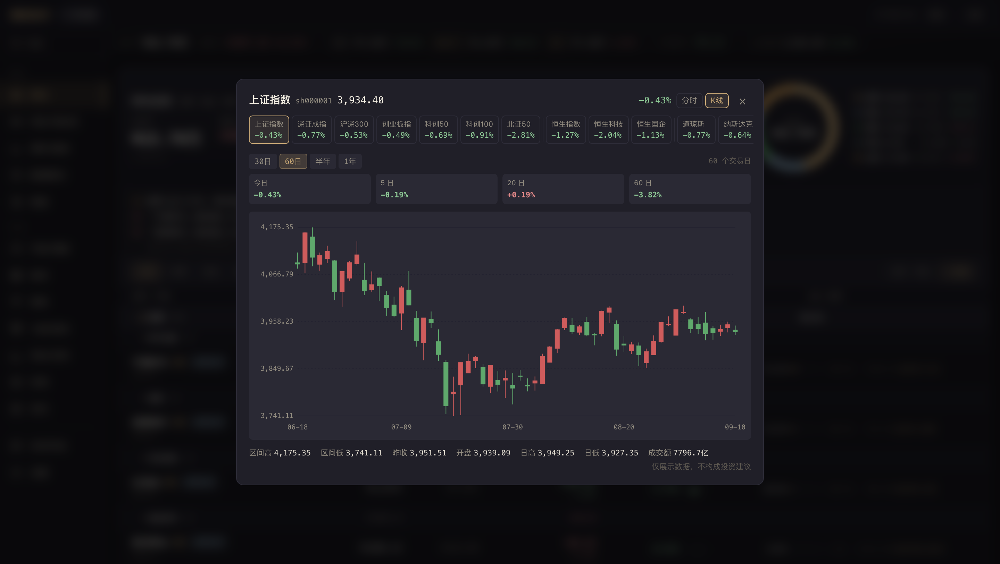

| 市场 | 指数 | 分时源 · 时段（各市场本地时间） | 成交额 |
|---|---|---|---|
| A股 | 上证 / 深成 / 沪深300 / 创业板 / 科创50 / 科创100 / 北证50 | 通达信 · 9:30-11:30 + 13:00-15:00 | 有 |
| 港股 | 恒生 / 恒生科技 / 恒生国企 | 腾讯 · 9:30-12:00 + 13:00-16:00 | 有 |
| 美股 | 道琼斯 / 纳斯达克 / 标普500 | Yahoo 1 分钟线 · 9:30-16:00 美东 | 源只给成交股数 |
| 海外 | 日经225 / 韩国KOSPI / 伦敦FTSE | 新浪环球 · 起点按当天首个分时点推 | 源不提供 |

<details>
<summary><b>四个源踩过的坑</b>（都留了可复现的判据）</summary>

- **新浪 `int_nikkei` / `int_ftse` 这两个符号停更了** — 日经报 44,946 而当日真实 69,220（差 35%），FTSE 报 9,285 而真实 10,736。判据：Yahoo `^N225`/`^FTSE` 与新浪自家 gi.finance 日K 逐日吻合（68,713.7969 对 68,713.8）。改成两源交叉校验：对得上保留原值（含收盘竞价的官方收盘更准），差得离谱整块换成 gi
- **港股那个大数字是「成交额(千港元)」不是成交量** — 顺序搞反会把恒生 2,108 亿显示成 125.8 亿。判据：该字段 ×1000 与腾讯分时末行的累计成交额逐一相等
- **美股指数没有成交额口径** — 某源那个"额"实测等于 `成交量 × 指数点位`（道指算出来每股 5.3 万美元），不是钱，所以这里显示成交量并标注「无成交额」。同理腾讯对美股**指数**只回一个收盘快照点，画不出分时，改用 Yahoo
- **美股盘前会把当日涨跌与开高低清零** — 照字段算就是「昨收=现价 +0.00%」，看着像平盘其实没开盘；这段窗口改用日K倒数两根补出上一交易日涨跌
- **时段起点按当天首个分时点推，不写死时钟** — 伦敦夏令时北京 15:00 开、冬令时 16:00 开且收盘跨零点（次日 00:30），自动跟着走

</details>

## 技术栈

**后端**：FastAPI + SQLite + akshare + Sina API + 东方财富 API + 同花顺 API + Claude API（OAuth，含 tool-calling agent + SSE 流式）

**前端**：React + Vite + Tailwind CSS + PWA（可装到桌面）

> `static/assets` 从磁盘直接伺服，重新构建立刻生效，但**已经开着的标签页不会自己换 bundle**——旧 JS 对着新 API 跑出来的毛病最难查（实测过一次：分组 chip 变成一排永不刷新的幽灵）。所以页面会拿自己这份 bundle 的文件名跟 `/api/app-version` 比，不一致就在右下角挂个「点此刷新」，不自动刷（免得打断正在输入的提问）。

**可选依赖**：pypdf + python-docx（只用于[知识星球](#zsxq)附件正文提取；不接这个功能可以不装）

<details>
<summary><b>数据源清单</b>（全部公开免费，点开看逐条来源）</summary>

- A股 行情：Sina `hq.sinajs.cn`
- A股 历史 K 线 + 行业：Sina money.finance + EastMoney emweb
- 基金 NAV：天天基金（fund.eastmoney.com）
- 基金持仓：天天基金 fundf10
- ETF 题材透视：东财场内 ETF 列表 + 基金季报持仓（akshare）+ 全 A 行业快照
- 港股个股：Sina hk
- 美股个股：Sina gb_
- 商品期货：Sina nf_ / hf_
- 指数分时：A股走通达信；港股走腾讯 `ifzq.gtimg.cn`（累计量额差分成逐分钟）；美股走 Yahoo `chart` 1 分钟线（时刻按其 gmtoffset 折成美东，自动跟夏令时）；日经/KOSPI/FTSE 走 Sina `gi.finance`
- 日经 / KOSPI / FTSE 实时点位：Sina `gi.finance`（`hq.sinajs` 的 int_ 符号已停更，见[全球指数条](#index-bar)）
- 行业板块：同花顺（akshare 内置）
- 数字资产：交易所公开 ticker
- 问问市场 agent：东财 个股资金流(fflow/kline) / 龙虎榜(全榜单+席位明细, akshare; 营业部历史明细走 datacenter dataapi) / 涨跌家数与涨跌分布(push2/push2ex) / F10 所属概念 / 财务摘要 / 港美股财务(em) / 板块成分 / 个股公告(np-anotice) / 业绩预告(akshare)
- 板块成交份额 / 情绪周期档案：同花顺板块汇总(akshare) / 东财涨停池系(akshare), 逐日定格进本地 SQLite
- 盘口异动：东财交易所盘口异动事件流(akshare stock_changes_em, 22 类事件逐类解析)
- 历史分时（K线浮层）：通达信协议，可选，见[可选：通达信数据源](#tdx)；昨收基准的除权还原用 东财分红送配明细（akshare）
- 自由查股搜索：与 agent 同一条 resolve 链路（持仓优先 → A股全表 → 6位代码直查 → 美股 ticker）
- 美股（agent）：Sina gb_ 报价（含盘前/盘后时段与各自时点）/ Yahoo 个股新闻（search + 逐票 RSS 合并）/ Yahoo 相关标的 / SEC EDGAR 公告（submissions API，8-K 按 Item 编号解释）
- 网页全文（read_url）：Firecrawl 免 key `/v1/scrape` 主源 + Jina Reader（r.jina.ai）免 key 备用，配额用完自动切换
- 观点面（可选）：知识星球官方 MCP 端点只读拉取（含附件研报正文，docx/pdf 本地抽文字），见[可选：知识星球](#zsxq)
- LLM：Claude API（OAuth via Claude Code 或 ANTHROPIC_API_KEY），个股问答 agent 走 tool-calling + 服务端联网搜索 + 网页全文抓取。开了 **prompt 缓存**（工具定义 + system 那几万 token 命中缓存价，实测多轮问答缓存命中率 90%+，首字更快）；服务端过载（429/529）按指数退避重发，超时**不**重发（服务端还在算，再发一遍只是加倍负载）

</details>

## 快速启动

```bash
git clone https://github.com/SnowWarri0r/licai
cd licai

# Python 后端
python3 -m venv venv && source venv/bin/activate
pip install -r requirements.txt

# 复制配置模板
cp config.example.py config.py
# 按需修改: commission_rate (你的券商佣金率) / patience_years / index_annual_return

# 前端构建
cd frontend && npm install && npm run build && cd ..

# 启动
python run.py
# 访问 http://localhost:8888
```

第一次启动会自动建空 SQLite (`portfolio.db`) 在项目根目录。

### 演示模式（不录数据先看效果）

```bash
python scripts/seed_demo.py --use   # 备份你的 DB + 写入演示数据 (4 只 A股 + 11 笔外部资产)
# 重启服务器, 看演示效果

python scripts/seed_demo.py --restore   # 看完恢复真实 DB
```

也可以 `--peek` 只生成 `portfolio.demo.db` 不动当前 DB。

### 可选：飞书通知

设置 → 飞书 Webhook → 粘贴 URL 保存。所有告警（档位触发 / 基本面恶化 / 早盘简报）会推送过去。

### 可选：交易所自动同步

设置 → 交易所 → 填 API Key + Secret + Passphrase（建议**只勾"读取"权限**）。机器人和现货持仓会自动同步。

### 可选：LLM 早盘简报

需要 Claude API 凭证。两种方式：
1. **OAuth**：装好 Claude Code（CLI）登录，会自动从 macOS Keychain 读 OAuth token
2. **API key**：`export ANTHROPIC_API_KEY=sk-ant-...`

不配也能用，只是早盘简报功能停用。

<h3 id="tdx">可选：通达信数据源（分时 / 周月K / 盘口 / 逐笔）</h3>

个股详情页的 **分时、周/月 K 线、五档盘口、逐笔成交**这四样需要一个本地通达信协议服务。

本项目对着 [SnowWarri0r/tdx-api](https://github.com/SnowWarri0r/tdx-api) 这个 fork 测的——它比上游多了三处修复：588/56x 场内 ETF 的市场前缀、`kline-history` 日期范围、端口可配。用上游也能跑：licai 侧请求一律显式带 `sh`/`sz`/`bj` 前缀，绕开了上游按代码长度推断市场那个坑。

```bash
# 起服务（Docker，详见该仓库 README）
# 然后二选一告诉 licai 它在哪:
export TDX_BASE_URL=http://localhost:8080     # 环境变量
# 或改 config.py 里的 tdx_base_url = "http://localhost:8080"
```

启动日志出现 `TDX 数据源已启用: <地址>` 即接通。**不配也能用**——详情页会收敛成只有「日」一个页签，实时行情、日线、看板与榜单都不依赖它。

<h3 id="zsxq">可选：知识星球（只读观点面）</h3>

现有情绪面全是指标（涨停/炸板/赚钱效应/连板高度），缺**文本面**——盘该怎么定性、社群在讲什么逻辑。接上之后 agent 多三个只读工具（`get_zsxq_digest` 读最近主题 / `search_zsxq` 按关键词搜 / `read_zsxq_file` 读附件正文），走知识星球官方 MCP 端点。

```
设置 → 知识星球 → 填入官方 MCP 端点 URL（带 api_key）→ 读取我的星球 → 勾选 → 保存
```

不用装 npm 包、不依赖系统 Keychain，填个 URL 就能跑；`services/mcp_http.py` 是个一百来行的极简 MCP streamable-HTTP 客户端（只实现 `tools/list` + `tools/call`，不引 SDK）。

五条约束（默认全关，不勾星球等于没这功能）：

- **只读白名单** — 远端 21 个工具里有 `create_topic` / `create_topic_comment` / `set_topic_digested` / `set_topic_tags` / `create_note` 这些写口，白名单（`_READ_TOOLS`）只放行取数的 10 个；万能口 `call_zsxq_api` 仅在「`GET` + 取文件直链」这一条组合下放行（见下方附件那条），其余一律拒且不发请求（有测试盯着）
- **可按星主收窄** — `scope=by_owner` 每个星球单独开关，默认不开：实测有的星球发帖人不算「星主/合伙人」，一开就筛成空（只剩几个月前的附件帖），所以默认全量、内容太杂再收
- **原文不落库** — 只在内存里过一遍送进模型，落 SQLite 的只该是提炼后的结论；不做成付费内容的本地镜像
- **附件按需读、不批量爬** — 帖子里的研报/会议记录（docx·pdf）可按 `file_id` 单份取正文（`read_zsxq_file`），字节只过内存不落盘、有大小上限、扫描件取不到文字会如实说明。取直链要走远端那个万能 `call_zsxq_api`，所以额外钉死成**只允许 `GET` + 只允许「取文件直链」这一条 path**（有测试覆盖 POST / 其他 path / 路径穿越都被拒）。**平台对每个附件按次计数**，所以只做按需单取，不做遍历下载
- **单独一档可信度** — 返回带 `stance=opinion`，回答里按 `[星球观点]` 标注并带作者日期；数字与结论一律以 `[实测]`/`[联网]` 为准，原文里的操作倾向只当「有人这么说」的舆情记录

api_key 拼在 URL 里，所以：**存本机数据库**（不进 `config.py`）、界面只回显 `host/path`、启动日志也只打脱敏值、只收 `https`。没接入时这三个工具不塞给模型（35 → 38 动态过滤），免得模型去调然后拿一串 error。

> 内容版权与平台条款属于你和知识星球之间的事：请用**自己的账号**、遵守所在星球的规则，本项目只提供只读通道。

## 项目结构

<details>
<summary><b>目录树</b>（点开看每个模块干什么）</summary>

```
licai/
├── api/                  # FastAPI 路由
│   ├── portfolio_routes  # A股 持仓 / 历史交易
│   ├── assets_routes     # 外部资产 (基金/理财/现金/加密/机器人)
│   ├── briefing_routes   # 早盘简报
│   ├── sector_routes     # 板块雷达
│   ├── settings_routes   # 飞书 / 风控配置
│   ├── market_routes     # 市场指数 / 情绪 / 人气榜
│   ├── ask_routes        # 问问市场 agent 端点（SSE 流式 + 多轮）
│   └── ws.py             # WebSocket + 后台任务
├── services/
│   ├── stock_agent       # 问问市场 agent（36 个工具 + tool-calling loop + 裸K量价/结构形态/产业链/来源角标/read_url）
│   ├── portfolio_curve   # 组合净值曲线（TWR/回撤/相关性矩阵/每日快照预热）
│   ├── coiled_scanner    # 蓄势/强势结构扫描（规则闸 + AI 看图复核）
│   ├── lhb_detail        # 龙虎榜席位明细 + 每日全榜单 + 席位画像 + 席位追踪
│   ├── watchlist         # 观察池(分组管理·一票多组 + 行情+结构形态+业绩预告)
│   ├── stock_changes     # 盘口异动事件流(22类解析+全天脉搏+最活跃统计)
│   ├── sentiment_history # 情绪周期逐日档案(涨停/炸板/赚钱效应序列)
│   ├── sector_share      # 板块成交额份额 + 逐日档案(份额迁移)
│   ├── concept_tags      # 榜单概念标签清洗 + 聚堆(同义并堆, 判"钱堆在哪条线")
│   ├── concept_trend     # 概念线几日资金曲线(份额变化=接力/退潮, 覆盖不够就不出结论)
│   ├── ask_runs          # 一轮 agent 的生命周期(跑在服务端, 切页/刷新不打断; 过程落盘, 重启后能看到跑到哪一步)
│   ├── trade_fills       # 分笔成交合并(一次委托的多笔成交按一次决策算)
│   ├── exposure          # 穿透敞口(基金拆到季报前十大 → 同标的/同行业合并 → 同源风险; 支持 as_of 回看某天)
│   ├── eod_summary       # 收盘持仓小结(全组合, 飞书+站内)
│   ├── inst_flow         # 机构席位动向统计
│   ├── earnings_board    # 业绩预告看板
│   ├── event_calendar    # 持仓事件日历（披露日/除权/解禁）
│   ├── exright           # 除权精确还原（分红送配明细逐事件逆变换）
│   ├── market_data       # 行情接口 (Sina/EM)
│   ├── external_assets   # 基金 + 数字资产 + 期货 + 港美股 quote
│   ├── mcp_http          # 极简 MCP streamable-HTTP 客户端(tools/list + tools/call, 不引 SDK)
│   ├── zsxq_client       # 知识星球只读接入(观点面; 只读白名单 + 附件正文提取, 默认关)
│   ├── fund_proxy        # 基金代理标的（top10 持仓加权）
│   ├── fund_holdings     # 天天基金 top10 抓取
│   ├── sector_compare    # 同花顺板块对比
│   ├── etf_xray          # ETF 题材透视（季报成分 vs 宣称主题）
│   ├── morning_briefing  # LLM 早盘简报
│   ├── fundamental_score # 基本面健康度（期货 + 新闻 + LLM）
│   ├── position_ledger   # 综合成本法（含手续费/印花税/过户费）
│   ├── exchange_client   # 数字资产平台私有 API（机器人/现货同步）
│   ├── feishu_notify     # 飞书 webhook
│   ├── llm_client        # Claude API (OAuth + API key 双模式)
│   └── news              # 新闻抓取
├── frontend/             # React + Vite
├── config.example.py     # 配置模板
├── database.py           # SQLite + schema
├── run.py                # FastAPI entry
└── requirements.txt
```

</details>

## 定位与免责声明

- 本项目是**个人自用的只读资产看板**：所有功能限于展示与分析用户自有账户数据,不提供也永不添加任何交易执行、兑换、撮合、代客理财或推广引流(邀请码/返佣)功能。
- 数字资产模块仅通过**只读 API Key** 读取用户自有账户余额与历史(设计约束,详见 `services/okx_client.py` 模块头),服务端没有任何下单代码路径。
- 全部输出为客观信息整理与结构描述,**不构成投资建议**;数字资产在中国境内的相关业务活动属非法金融活动,个人投资风险自担(参见央行等八部门 2026 年通知),使用本工具不改变上述法律状态。

## 数据隐私

- **所有数据存本地 SQLite**，不上传任何云端
- 实时行情从公开接口拉，**不需要任何账号**
- 交易所 / LLM 凭证存数据库本地，飞书 webhook 也是
- `portfolio.db` 已在 `.gitignore` 里，不会被 commit
- 备份在 `backups/` 目录每天自动保留 30 天

## 已知限制

- **akshare** 依赖东方财富 API，部分接口（push2.eastmoney.com）会限流甚至整段不可达（实测某些网络下直接断连），已对这种情况做了 fallback（同花顺 + 新浪 gi.finance + 硬编码 ETF 兜底）
- **LibreSSL 老版本** macOS 系统 Python 3.9 用 LibreSSL 2.8.3，跟某些 EM 接口 TLS 握手不稳，已用 subprocess curl 兜底
- **数据源的口径要自己验** — 免费源里字段错位（昨收取成今开）、单位不明（千元当成股数）、符号停更都遇到过，本项目的处理方式是拿第二个源交叉校验后写进注释与测试，而不是信任单一来源
- 跑在国内非代理环境，海外接口（Claude API / 交易所 / Yahoo）需要自行处理网络

## License

[GNU AGPL-3.0](./LICENSE)

为啥选 AGPL：这是个**完整应用**而不是库，AGPL 防止有人 fork 后包成 SaaS 卖钱不开源回馈。你 self-host 用 / 个人 fork 改造完全没限制。

## Contributing

欢迎 Issue / PR。因为是个人理财工具，特别欢迎：
- 你自己用着不爽的细节体验
- 新数据源接入（券商对账单导入 / 银行 OCR / 雪球同步）
- 投资组合分析新指标（夏普比率 / 最大回撤 / VaR）
- 国际化（目前只有中文 + A股/港股/美股；如果要做欧洲市场 PR welcome）

## Star History

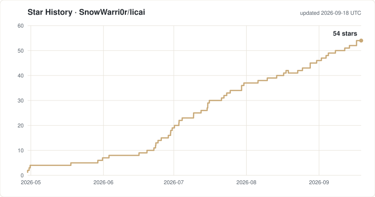

> GitHub 2026 年 7 月起收紧了 stargazers 接口权限,star-history.com 的嵌图对非协作者失效——这张图由仓库内 [GitHub Action](.github/workflows/star-chart.yml) 每日自渲染,不依赖第三方服务。
